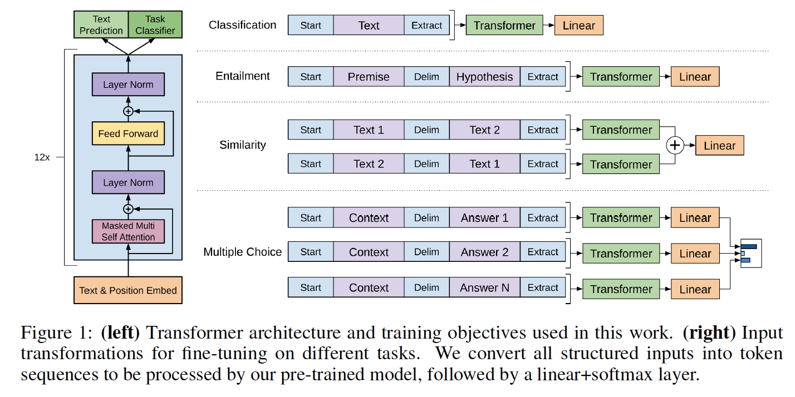

# PyTorch implementation of OpenAI's Finetuned Transformer Language Model

This repo is modified from [ORIGINAL PYTORCH IMPLEMENTATION](https://github.com/huggingface/pytorch-openai-transformer-lm). 

The project report is named 'Story Cloze Test with Fine AdjustmentSchemes of GPT-2 Model.pdf' under this directory.

## Original README

This is a PyTorch implementation of the [TensorFlow code](https://github.com/openai/finetune-transformer-lm) provided with OpenAI's paper ["Improving Language Understanding by Generative Pre-Training"](https://blog.openai.com/language-unsupervised/) by Alec Radford, Karthik Narasimhan, Tim Salimans and Ilya Sutskever.

This implementation comprises **a script to load in the PyTorch model the weights pre-trained by the authors** with the TensorFlow implementation.



The model classes and loading script are located in [model_pytorch.py](model_pytorch.py).

The names of the modules in the PyTorch model follow the names of the Variable in the TensorFlow implementation. This implementation tries to follow the original code as closely as possible to minimize the discrepancies.

This implementation thus also comprises a modified Adam optimization algorithm as used in OpenAI's paper with:
- fixed weights decay following the work of [Loshchilov et al.](https://arxiv.org/abs/1711.05101), and
- scheduled learning rate as [commonly used for Transformers](http://nlp.seas.harvard.edu/2018/04/03/attention.html#optimizer).

## Requirements
To use the model it-self by importing [model_pytorch.py](model_pytorch.py), you just need:
- PyTorch (version >=0.4)

To run the classifier training script in [train.py](train.py) you will need in addition:
- tqdm
- sklearn
- spacy
- ftfy
- pandas

## Fine-tuning the pre-trained model on a classification task
The ROCStories dataset can be downloaded from the associated [website](http://cs.rochester.edu/nlp/rocstories/).

As with the [TensorFlow code](https://github.com/openai/finetune-transformer-lm), this code implements the ROCStories Cloze Test result reported in the paper which can be reproduced by running:

```bash
python -m spacy download en
python train.py --dataset rocstories --desc rocstories --submit --analysis --data_dir data
```
Since we have 5 datasets in our data_dir, you will need to modify the path of the data in datasets.py, in order to get the 5 results mentioned in our paper.

In baseline model, we used the original validation set as our training data. In case 1, we used reorganized validationset as training data, and tested on reorganized testing set. In case 2, we used reorganized validation set as training data,and tested on the original testing set. In case 3, we combinedthe manually generated antonym sentences with the validationset as our new training set, and then tested on the original testset. In case 4, we only used the last sentence of the validationset as our training data, and tested on the original testing set.

#### First experiments on the ROCStories test set
The test accuracy for baseline model is 86.53%, for case 1 is 86.37%, for case 2 is 85.89%, for case 3 is 85.36%, and for case 4 is 84.5%.

